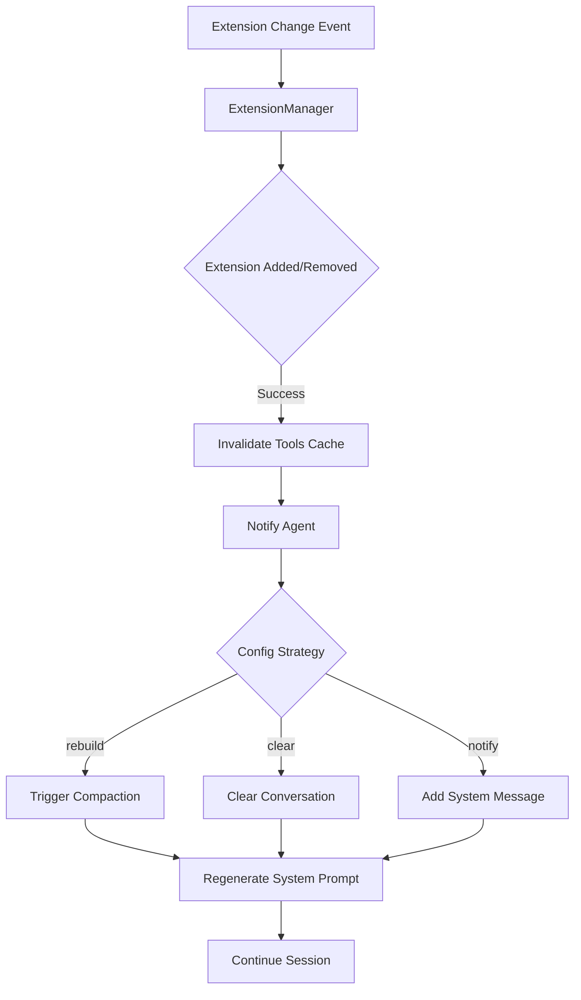

# Extension Context Invalidation Implementation Plan

## Problem Statement

When extensions are enabled or disabled during a session, the LLM context is not invalidated. This causes the LLM to continue operating with a stale system prompt that lists outdated tool definitions, leading to:

- Newly enabled tools being available but unknown to the LLM
- Disabled tools remaining in the LLM's context window
- Confusion and potential errors in tool usage

## Root Cause Analysis

### Current Flow

1. User calls `manage_extensions` tool to enable/disable an extension
2. [`ExtensionManager::add_extension()`](../crates/goose/src/agents/extension_manager.rs#L795) or [`ExtensionManager::remove_extension()`](../crates/goose/src/agents/extension_manager.rs#L1085) updates internal state
3. [`invalidate_tools_cache_and_bump_version()`](../crates/goose/src/agents/extension_manager.rs#L1246) clears the tools cache
4. **Missing**: No mechanism to invalidate or update the LLM's conversation context

### Why This Happens

The system prompt (which includes tool definitions) is generated in [`Agent::prepare_reply_context()`](../crates/goose/src/agents/agent.rs#L593) at the start of each reply cycle. However:

- Extension changes happen mid-conversation
- The conversation history retains the old system prompt
- The LLM continues with stale context until the next reply cycle
- Even in the next cycle, the old system prompt remains in conversation history

## Proposed Solution

### Three Context Invalidation Strategies

We will implement three configurable strategies for handling extension changes:

#### 1. Context Rebuild (Default)
- Trigger conversation compaction when extensions change
- Regenerate system prompt with updated tool list
- Preserve conversation history but update context
- Uses existing [`compact_messages()`](../crates/goose/src/context_mgmt/mod.rs#L65) infrastructure

**Pros:**
- Maintains conversation continuity
- Efficient use of context window
- Leverages existing compaction logic

**Cons:**
- Requires summarization (uses tokens)
- Slight delay during compaction

#### 2. Clear History
- Reset conversation entirely when extensions change
- Start fresh with new system prompt
- Lose all conversation history

**Pros:**
- Clean slate, no confusion
- Simple implementation
- No token cost for summarization

**Cons:**
- Loses all conversation context
- Disruptive to user workflow

#### 3. Notification
- Add a system message explaining tool changes
- Continue with existing conversation
- Inform LLM about new/removed tools

**Pros:**
- Minimal disruption
- Maintains full history
- Explicit communication to LLM

**Cons:**
- Doesn't actually update system prompt
- May confuse some models
- Increases context size

## Implementation Architecture



## Detailed Implementation Plan

### Phase 1: Configuration

**File:** `crates/goose/src/config/base.rs`

Add new configuration option:

```rust
pub enum ExtensionChangeStrategy {
    Rebuild,  // Default
    Clear,
    Notify,
}

// In Config struct
pub fn get_extension_change_strategy(&self) -> ExtensionChangeStrategy {
    // Read from GOOSE_EXTENSION_CHANGE_STRATEGY env var
    // Default to Rebuild
}
```

### Phase 2: Context Invalidation Method

**File:** `crates/goose/src/agents/agent.rs`

Add new method to Agent:

```rust
pub async fn invalidate_context_for_extension_change(
    &self,
    session_id: &str,
    strategy: ExtensionChangeStrategy,
) -> Result<()> {
    match strategy {
        ExtensionChangeStrategy::Rebuild => {
            // Trigger compaction
            self.trigger_context_rebuild(session_id).await?;
        }
        ExtensionChangeStrategy::Clear => {
            // Clear conversation history
            self.clear_conversation_history(session_id).await?;
        }
        ExtensionChangeStrategy::Notify => {
            // Add system notification message
            self.add_extension_change_notification(session_id).await?;
        }
    }
    Ok(())
}

async fn trigger_context_rebuild(&self, session_id: &str) -> Result<()> {
    // Get current session and conversation
    let session = self.config.session_manager.get_session(session_id, false).await?;
    let conversation = Conversation::new_unvalidated(session.messages.clone());
    
    // Trigger compaction with special flag for extension changes
    let provider = self.provider().await?;
    let (compacted_conversation, _usage) = compact_messages(
        provider.as_ref(),
        session_id,
        &conversation,
        false, // not manual
    ).await?;
    
    // Replace conversation in session
    self.config.session_manager
        .replace_conversation(session_id, &compacted_conversation)
        .await?;
    
    Ok(())
}

async fn clear_conversation_history(&self, session_id: &str) -> Result<()> {
    // Clear all messages except system
    let empty_conversation = Conversation::default();
    self.config.session_manager
        .replace_conversation(session_id, &empty_conversation)
        .await?;
    Ok(())
}

async fn add_extension_change_notification(&self, session_id: &str) -> Result<()> {
    // Add a system message about tool changes
    let message = Message::assistant()
        .with_text("Note: Available tools have changed due to extension modifications. Please review the updated tool list.")
        .with_metadata(MessageMetadata::agent_only());
    
    self.config.session_manager
        .add_message(session_id, &message)
        .await?;
    Ok(())
}
```

### Phase 3: Hook into Extension Manager

**File:** `crates/goose/src/agents/extension_manager.rs`

Modify `add_extension()` and `remove_extension()` to notify agent:

```rust
pub async fn add_extension(
    self: &Arc<Self>,
    config: ExtensionConfig,
    working_dir: Option<PathBuf>,
    container: Option<&Container>,
    session_id: Option<&str>,
) -> ExtensionResult<()> {
    // ... existing code ...
    
    self.invalidate_tools_cache_and_bump_version().await;
    
    // NEW: Notify about extension change
    if let Some(sid) = session_id {
        self.notify_extension_change(sid).await;
    }
    
    Ok(())
}

async fn notify_extension_change(&self, session_id: &str) {
    // Emit event or call agent method
    // This will be implemented via the context reference
}
```

### Phase 4: Integration with Agent Loop

**File:** `crates/goose/src/agents/agent.rs`

Update the section where extension changes are detected (around line 1937):

```rust
if all_install_successful && !enable_extension_request_ids.is_empty() {
    if let Err(e) = self.save_extension_state(&session_config).await {
        warn!("Failed to save extension state after runtime changes: {}", e);
    }
    tools_updated = true;
    
    // NEW: Invalidate context
    let strategy = Config::global().get_extension_change_strategy();
    if let Err(e) = self.invalidate_context_for_extension_change(
        &session_config.id,
        strategy
    ).await {
        warn!("Failed to invalidate context after extension change: {}", e);
    }
}
```

### Phase 5: CLI Configuration

**File:** `crates/goose-cli/src/commands/configure.rs`

Add configuration option to CLI:

```rust
pub async fn configure_extension_change_strategy() -> anyhow::Result<()> {
    let strategy = cliclack::select("How should goose handle extension changes?")
        .item("rebuild", "Rebuild context (recommended)", "Compact conversation and regenerate system prompt")
        .item("clear", "Clear history", "Start fresh conversation when extensions change")
        .item("notify", "Notify only", "Add message about changes but keep history")
        .interact()?;
    
    // Save to config
    Config::global().set_param("GOOSE_EXTENSION_CHANGE_STRATEGY", strategy)?;
    
    Ok(())
}
```

## Testing Strategy

### Unit Tests

1. **Test context rebuild strategy**
   - Verify compaction is triggered
   - Verify system prompt is regenerated
   - Verify conversation history is preserved

2. **Test clear history strategy**
   - Verify conversation is cleared
   - Verify only system messages remain

3. **Test notification strategy**
   - Verify notification message is added
   - Verify message has correct metadata

### Integration Tests

1. **End-to-end extension change flow**
   - Enable extension mid-conversation
   - Verify LLM receives updated tool list
   - Verify LLM can use new tools

2. **Multiple extension changes**
   - Enable/disable multiple extensions
   - Verify context updates correctly each time

3. **Strategy switching**
   - Test changing strategies mid-session
   - Verify behavior matches selected strategy

## Migration Path

### Default Behavior
- Set `rebuild` as default strategy
- No breaking changes for existing users
- Automatic context updates on extension changes

### User Configuration
- Add to `goose configure` menu
- Document in user guide
- Provide environment variable override

## Performance Considerations

### Context Rebuild Strategy
- **Token Cost**: Summarization uses tokens (estimated 10-20% of context)
- **Latency**: 1-3 seconds for compaction
- **Benefit**: Maintains conversation quality

### Clear History Strategy
- **Token Cost**: None
- **Latency**: Instant
- **Drawback**: Loses all context

### Notification Strategy
- **Token Cost**: Minimal (one message)
- **Latency**: Instant
- **Drawback**: May not be effective for all models

## Future Enhancements

1. **Smart Detection**: Only invalidate if tools actually changed
2. **Partial Updates**: Update only affected portions of context
3. **Async Compaction**: Perform compaction in background
4. **User Prompts**: Ask user which strategy to use on first extension change

## Success Criteria

- [ ] Extension changes trigger context invalidation
- [ ] All three strategies work correctly
- [ ] Configuration is accessible via CLI
- [ ] Tests pass for all strategies
- [ ] Documentation is updated
- [ ] No performance regression
- [ ] User feedback is positive

## Timeline

- **Phase 1-2**: 2-3 days (Configuration + Core implementation)
- **Phase 3-4**: 1-2 days (Integration)
- **Phase 5**: 1 day (CLI updates)
- **Testing**: 2 days
- **Documentation**: 1 day

**Total Estimated Time**: 7-9 days